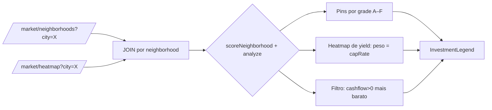

# 09 — Overlay de Investimento no Mapa (Investment Layer)

> **Autor:** Frontend / Maps Engineer — LandMap War Room
> **Status:** Plano + componente isolado (`InvestmentLegend.tsx`)
> **Escopo:** Aditivo. **NÃO** reescreve `apps/web/src/app/[locale]/map/page.tsx`.
> **Fontes:** `apps/web/src/app/[locale]/map/page.tsx`, `packages/api/src/routes/market.ts`, `packages/invest/src/{types,metrics,opportunity}.ts`.

---

## 1. Objetivo

Adicionar uma **camada "Investment"** sobre o mapa existente que:

1. Pinta **pins por nota (A–F)** calculada via `analyze()`/`scoreNeighborhood()` a partir de `/market/neighborhoods` (preço) + `/market/heatmap` (coordenadas/demanda).
2. Oferece o filtro **"cashflow positivo mais barato"** (`analyze().monthlyCashflow > 0` ordenado por `price`).
3. Renderiza um **heatmap de yield** usando `/market/heatmap` + invest engine, com peso = `capRate`.
4. Exibe a **legenda de cores por grade** (componente novo e isolado `InvestmentLegend.tsx`).
5. Faz o **wiring de dados** `fetch /market/neighborhoods + /market/heatmap → analyze()/scoreNeighborhood() → pintar`.

---

## 2. Pré-requisitos importantes (leia antes de codar)

- `apps/web` **ainda NÃO** declara `@landmap/invest` como dependência. Prova: `apps/web/src/components/InvestmentCard.tsx` espelha `InvestmentGrade`/`InvestmentResult` **localmente** justamente para não quebrar o typecheck.
  → Por isso **o componente `InvestmentLegend.tsx` também espelha o tipo localmente** e importa só `cn` de `@landmap/ui`.
- O scoring client-side (`scoreNeighborhood`/`analyze`) só é viável após adicionar `@landmap/invest` às deps do `apps/web` **ou** expor o endpoint futuro `GET /invest/opportunities` (ver §8, Opção B — **recomendada** para manter o padrão "tudo via `API_BASE`" já usado no `map/page.tsx`).

### Paleta canônica grade → cor (herdada de `InvestmentCard.tsx`)

| Grade | Score | Token CSS | Hex fallback |
|-------|--------|-----------|--------------|
| A | 80–100 | `var(--emerald-bright)` | `#34d399` |
| B | 65–79  | `var(--cyan)`          | `#22d3ee` |
| C | 50–64  | `var(--violet)`        | `#a78bfa` |
| D | 35–49  | `var(--gold-soft)`     | `#e8c873` |
| F | 0–34   | `var(--danger)`        | `#ff4d4d` |

Essa mesma paleta está exportada em `INVESTMENT_GRADE_COLORS` (em `InvestmentLegend.tsx`) para o pintor de pins reaproveitar **exatamente** as mesmas cores da legenda.

---

## 3. Modelo de dados & fontes

### `/market/neighborhoods?city=X` → `NeighborhoodStat[]`
`packages/api/src/routes/market.ts:9-16,107-140`
```ts
{ name: string; city: string; state: string; count: number; avgPriceM2: number; avgPrice: number }
```
→ alimenta **preço** (`price = avgPrice`) e **liquidez** (`count`) do `analyze()`/`scoreNeighborhood()`.

### `/market/heatmap?city=X` → `HeatmapPoint[]`
`packages/api/src/routes/market.ts:23-29,191-220`
```ts
{ lat: number; lng: number; weight: number; neighborhood: string; avgPrice: number }
```
→ fornece **coordenadas** (para posicionar o pin) e **demanda** (`weight` 0–1) para o `scoreNeighborhood()`.

### Engine de investimento — `packages/invest`
- `analyze(a: InvestmentAssumptions): InvestmentResult` — `metrics.ts:402`. Retorna `grade`, `score`, `capRate`, `monthlyCashflow`, etc.
- `scoreNeighborhood(stat, trend?, heat?, opts?): OpportunityScore` — `opportunity.ts:219`. Usa `avgPrice` como `price`, deriva aluguel de `annualRentYieldPct` (default **6%** → `monthlyRent = avgPrice * 0.06 / 12`), e pondera yield + valorização + liquidez + demanda (heatmap).
- `grade(score: number): 'A'|'B'|'C'|'D'|'F'` — `metrics.ts:388` (A≥80, B≥65, C≥50, D≥35, senão F).

### JOIN necessário (neighborhoods não têm lat/lng)
Combine `/neighborhoods` (preço) com `/heatmap` (coords) **pelo nome do bairro**:
```ts
const byName = new Map(heat.map((h) => [h.neighborhood, h]));
const points = nb.items
  .map((n) => { const h = byName.get(n.name); return h ? { n, h } : null; })
  .filter((x): x is { n: NeighborhoodStat; h: HeatmapPoint } => x !== null);
```

---

## 4. Camada "Investment" — pins coloridos por grade

Todos os snippets abaixo são **aditivos**: indicam *onde* inserir dentro de `map/page.tsx` (âncoras por número de linha do arquivo atual). Nada é reescrito.

### 4.1 — Import do componente de legenda (após a linha 9)
```tsx
// apps/web/src/app/[locale]/map/page.tsx  (após a linha 9)
import { InvestmentLegend } from '../../../components/InvestmentLegend';
```

### 4.2 — Novo estado (após as linhas 80–84, bloco do heatmap)
```tsx
/* ─── Investment layer (toggle) ─── */
const [investCity, setInvestCity] = useState('Curitiba');
const [invest, setInvest] = useState<InvestPoint[]>([]);
const [showInvest, setShowInvest] = useState(false);
const [investLoading, setInvestLoading] = useState(false);

// Tipo local do ponto já pontuado (grade + capRate + cashflow):
// type InvestPoint = { name: string; lat: number; lng: number;
//   avgPrice: number; grade: InvestmentGrade; score: number;
//   capRate: number; monthlyCashflow: number };
```

### 4.3 — Fetch + scoring (novo `useEffect`, após o de heatmap nas linhas 86–104)
```tsx
useEffect(() => {
  if (!showInvest) return;
  let active = true;
  setInvestLoading(true);
  Promise.all([
    fetch(`${API_BASE}/market/neighborhoods?city=${encodeURIComponent(investCity)}`, { cache: 'no-store' }).then((r) => r.json()),
    fetch(`${API_BASE}/market/heatmap?city=${encodeURIComponent(investCity)}`, { cache: 'no-store' }).then((r) => r.json()),
  ])
    .then(([nb, hm]: [{ items?: any[] }, { points?: any[] }]) => {
      const byName = new Map((hm.points ?? []).map((h) => [h.neighborhood, h]));
      const scored = (nb.items ?? [])
        .map((n) => {
          const h = byName.get(n.name);
          if (!h) return null;
          const s = scoreNeighborhood(n, undefined, h);   // ← requer @landmap/invest (§8)
          const a = analyze(toAssumptions(n, { trend: undefined, heat: h })); // cashflow
          return {
            name: n.name, lat: h.lat, lng: h.lng, avgPrice: n.avgPrice,
            grade: s.grade, score: s.score,
            capRate: s.yieldPct / 100, monthlyCashflow: a.monthlyCashflow,
          } as InvestPoint;
        })
        .filter((x): x is InvestPoint => x !== null);
      if (active) setInvest(scored);
    })
    .catch(() => { if (active) setInvest([]); })
    .finally(() => { if (active) setInvestLoading(false); });
  return () => { active = false; };
}, [showInvest, investCity]);
```

### 4.4 — Toggle na UI (após o bloco "Heatmap de preço", linhas 318–337)
```tsx
{/* Investment layer */}
<div className="flex flex-wrap items-center gap-3 border-t border-neutral-800 pt-4">
  <span className="text-xs text-neutral-500">Camada de investimento:</span>
  <input
    value={investCity}
    onChange={(e) => setInvestCity(e.target.value)}
    aria-label="Cidade da análise de investimento"
    placeholder="Cidade"
    className="w-40 rounded-lg border border-neutral-800 bg-neutral-950 px-3 py-1.5 text-sm text-neutral-50 outline-none transition focus:border-emerald-400"
  />
  <button
    type="button"
    onClick={() => setShowInvest((v) => !v)}
    aria-pressed={showInvest}
    className={showInvest ? 'btn btn-primary' : 'btn btn-ghost'}
  >
    {showInvest ? 'Ocultar investimento' : 'Mostrar investimento'}
  </button>
  {investLoading && <span className="text-xs text-neutral-500">Calculando…</span>}
</div>
```

### 4.5 — Legenda (após o bloco de legenda por tipo, linhas 298–316)
```tsx
<InvestmentLegend title="Nota de investimento (A–F)" showHints compact />
```


### 4.6 — Passar props para `<MapView>` (linhas 366–378)
```tsx
<MapView
  /* …props existentes… */
  invest={invest}
  showInvest={showInvest}
/>
```

### 4.7 — Pintar pins por grade dentro de `MapView`
Adicione `invest`/`showInvest` ao tipo de props (linhas 390–410) e um novo `useEffect` espelhando o do heatmap (linhas 513–544), usando `INVESTMENT_GRADE_COLORS` exportado pela legenda:
```tsx
useEffect(() => {
  const map = mapInstance.current;
  if (!map) return;
  const L = (window as any).L;
  if (!L) return;

  investRef.current.forEach((m) => map.removeLayer(m));
  investRef.current = [];
  if (!showInvest || invest.length === 0) return;

  invest.forEach((p) => {
    const color = INVESTMENT_GRADE_COLORS[p.grade];
    const marker = L.circleMarker([p.lat, p.lng], {
      radius: 9,
      fillColor: color,
      color,
      weight: 2,
      fillOpacity: 0.85,
    }).addTo(map).bindPopup(
      `<strong>${p.name}</strong><br/>` +
      `Nota: ${p.grade} (${Math.round(p.score)})<br/>` +
      `Preço médio: ${brl(p.avgPrice)}<br/>` +
      `Cap rate: ${(p.capRate * 100).toFixed(2)}%<br/>` +
      `Cashflow/mês: ${brl(p.monthlyCashflow)}`,
    );
    investRef.current.push(marker);
  });
}, [invest, showInvest]);
```
> `investRef` segue o mesmo padrão de `heatRef` (linha 414). `brl()` é o helper de moeda BRL já usado no arquivo.

---

## 5. Filtro "cashflow positivo mais barato"

Deriva direto do array `invest` já pontuado (§4.3). Sem nova fetch:
```tsx
const cheapestPositiveCashflow = [...invest]
  .filter((p) => p.monthlyCashflow > 0)
  .sort((a, b) => a.avgPrice - b.avgPrice)[0]; // mais barato com fluxo positivo
```
Exiba como dica acima do mapa quando `showInvest` estiver ativo:
```tsx
{showInvest && cheapestPositiveCashflow && (
  <p className="text-xs text-emerald-bright">
    Melhor entrada: {cheapestPositiveCashflow.name} — {brl(cheapestPositiveCashflow.avgPrice)}
    {' '}· cashflow {brl(cheapestPositiveCashflow.monthlyCashflow)}/mês (nota {cheapestPositiveCashflow.grade})
  </p>
)}
```


---

## 6. Heatmap de yield (peso = capRate)

Reaproveite o efeito do heatmap (linhas 513–544) criando um eixo `investHeat` onde o **peso é o capRate normalizado** (não o preço). Reutilize `weightColor()` (linhas 22–37) para a gradiente contínua emerald→cyan→violet:
```tsx
// Normaliza capRate 0..1 entre os pontos e pinta círculos:
const maxCap = Math.max(...invest.map((p) => p.capRate), 1e-6);
const yieldPoints = invest.map((p) => ({
  lat: p.lat, lng: p.lng,
  weight: Math.max(0, Math.min(1, p.capRate / maxCap)),
  name: p.name, capRate: p.capRate,
}));
// …no useEffect: L.circleMarker([p.lat,p.lng], { radius: 6 + p.weight*18,
//   fillColor: weightColor(p.weight), color: weightColor(p.weight),
//   weight:1, fillOpacity:0.45 })
```
Toggle separado (`showYield`) ou agrupado com `showInvest` — fica a critério de UX, mas mantenha **estados distintos** para não misturar pins discretos (A–F) com a superfície contínua de yield.

---

## 7. Legenda de cores por grade (`InvestmentLegend.tsx`)

Componente **novo e isolado** em `apps/web/src/components/InvestmentLegend.tsx`.
- Apresentacional puro: não fetcha, não depende de Leaflet, não toca no `map/page.tsx`.
- Espelha `InvestmentGrade` localmente (sem `@landmap/invest`) → **não quebra `pnpm -r typecheck`** (validado: `@landmap/web typecheck` passou).
- Usa `cn` de `@landmap/ui` e tokens (`--emerald-bright`, `--cyan`, `--violet`, `--gold-soft`, `--danger`) com fallback hex.
- Exporta `INVESTMENT_GRADE_COLORS` e `INVESTMENT_GRADES` para o pintor de pins (§4.7).

Uso:
```tsx
import { InvestmentLegend } from '../../../components/InvestmentLegend';

<InvestmentLegend title="Nota de investimento (A–F)" showHints compact />
// props: grades?: InvestmentGrade[] · showHints?: boolean · compact?: boolean · className?: string
```

---

## 8. Wiring de dados — fluxo end-to-end



### Opção A — client-side (requer dependência)
Adicionar `"@landmap/invest": "workspace:*"` em `apps/web/package.json` e importar `scoreNeighborhood`, `analyze`, `toAssumptions` (e o tipo `NeighborhoodStat`/tipo espelhado). Bundleia o engine no client — aceitável, é código puro/determinístico (`packages/invest` não tem IO).

### Opção B — endpoint futuro `/invest/opportunities` (RECOMENDADA)
Mantém o padrão "tudo via `API_BASE`" do `map/page.tsx` e evita acoplar o engine ao bundle web. Rota proposta em `packages/api/src/routes/invest.ts`:
```ts
// GET /invest/opportunities?city=X  ->  { city, total, items: InvestPoint[] }
// Cada item já vem com lat/lng (join heatmap), grade, score, capRate, monthlyCashflow.
marketApp.get('/opportunities', (c) => {
  const city = c.req.query('city') ?? '';
  const nb = neighborhoodsFor(city);          // reusa aggregateByNeighborhood
  const hm = heatmapFor(city);               // reusa /heatmap
  const byName = new Map(hm.map((h) => [h.neighborhood, h]));
  const items = nb
    .map((n) => {
      const h = byName.get(n.name);
      if (!h) return null;
      const s = scoreNeighborhood(n, undefined, h);
      const a = analyze(toAssumptions(n, { heat: h }));
      return { name: n.name, lat: h.lat, lng: h.lng, avgPrice: n.avgPrice,
        grade: s.grade, score: s.score, capRate: s.yieldPct / 100,
        monthlyCashflow: a.monthlyCashflow };
    })
    .filter(Boolean);
  return c.json({ city, total: items.length, items });
});
```
Assim o `map/page.tsx` troca o `Promise.all` do §4.3 por um único `fetch(`${API_BASE}/invest/opportunities?city=…`)`.

---

## 9. Checklist de implementação (aditivo)

- [ ] Adicionar import de `InvestmentLegend` (§4.1).
- [ ] Adicionar estado `investCity/invest/showInvest/investLoading` + tipo `InvestPoint` (§4.2).
- [ ] Adicionar `useEffect` de fetch+scoring (§4.3) — via Opção A ou B.
- [ ] Adicionar toggle "Camada de investimento" na UI (§4.4).
- [ ] Adicionar `<InvestmentLegend />` na área de legendas (§4.5).
- [ ] Passar `invest`/`showInvest` para `<MapView>` (§4.6).
- [ ] Dentro de `MapView`: novo prop + `useEffect` pintando `circleMarker` por `INVESTMENT_GRADE_COLORS` (§4.7).
- [ ] Filtro "cashflow positivo mais barato" (§5).
- [ ] Heatmap de yield com peso = capRate (§6).
- [ ] `pnpm -r typecheck` verde (componente isolado já validado).

---

## 10. Notas de acessibilidade / performance

- `aria-pressed` nos botões de toggle (padrão já usado no heatmap, linha 331).
- `aria-label` na legenda e contraste AA dos tokens (emerald-bright/cyan/violet/gold-soft sobre `bg-neutral-900`).
- `prefers-reduced-motion`: os círculos são estáticos (Leaflet), sem animação extra.
- Limpar camadas (`investRef.forEach(removeLayer)`) a cada render para evitar vazamento de markers — igual ao `heatRef`.
- O scoring é determinístico e barato; ainda assim, só roda quando `showInvest` está ativo (early-return no `useEffect`), igual ao heatmap.

